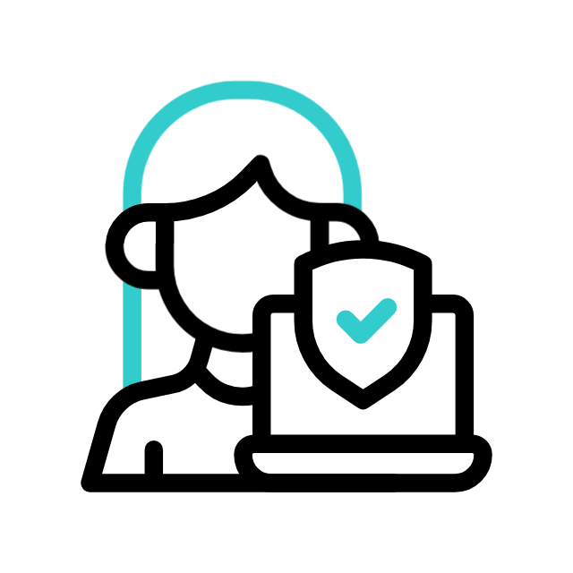

# Hello, I'm Anna Roytberg     

 
 

Cybersecurity student at Collin College focused on building practical security skills. This GitHub showcases cybersecurity projects, labs, and beginner coding projects that reflect my learning journey and technical growth.

<h2>Cybersecurity Projects:</h2> 

- [Building A Network (Hands-on)](https://annarcyb.github.io/In-Person-Network-Build-Lab/)

<h2>📺 Coding Projects</h2>

  <b>All projects are personalized by me, including my own drawings.</b>
  
- <b>HTML | CSS | Javascript</b>
  - [Beginner Pac-Man Game](https://annarcyb.github.io/Beginner-Pac-Man-Game/)
  - [Beginner To-Do List](https://annarcyb.github.io/Beginner-To-Do-List/) 

<h2> 🤳 Connect with me:</h2>

